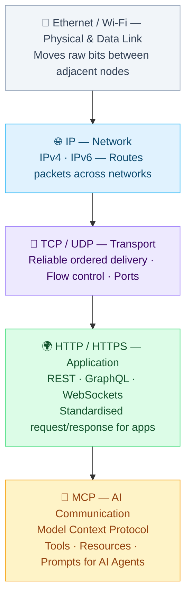
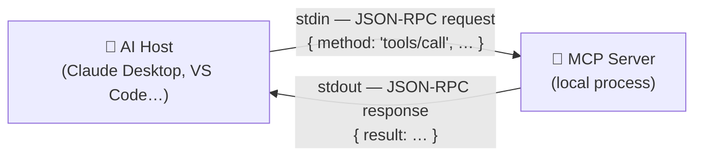
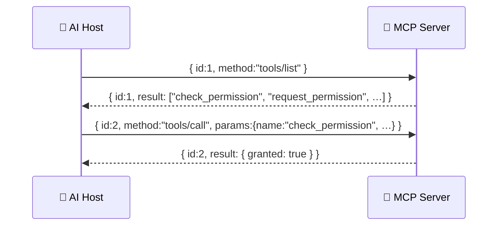
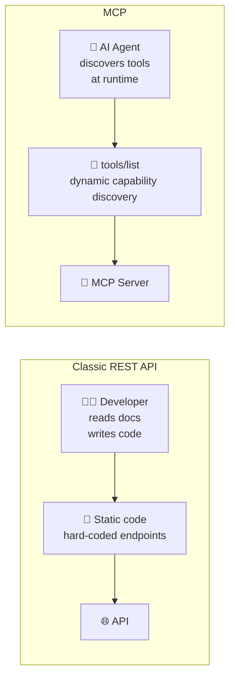
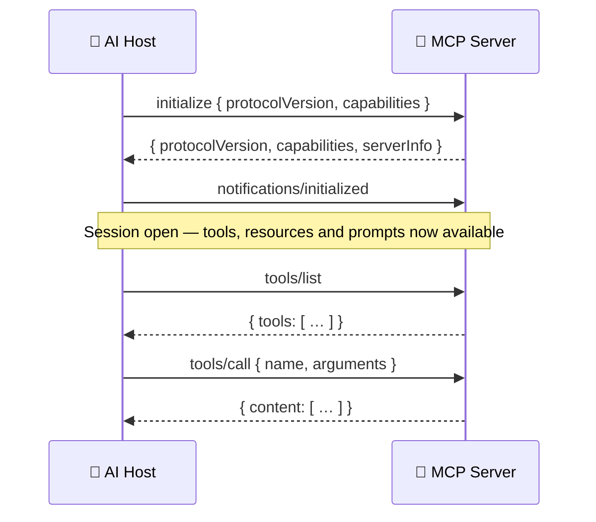
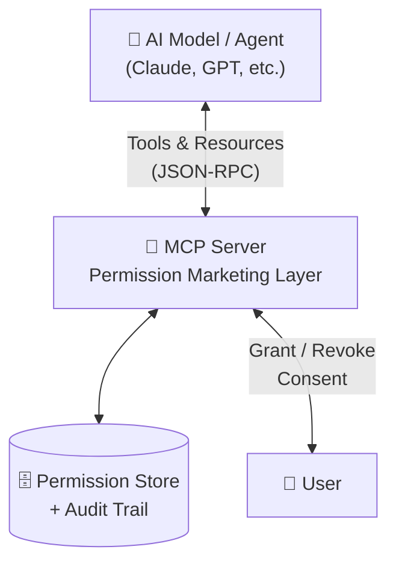

# What is MCP? — Model Context Protocol Explained

> **Cross-reference:** Referenced from [PRESENTATION.md](PRESENTATION.md) between Slide 5 and Slide 7.  
> Use these two slides as a self-contained MCP introduction block.

---

## SLIDE 5b — What is MCP? (Part 1) — The Protocol Stack Analogy

### Headline
Every Great Leap Is a New Layer

### Body Text
We have been building networked systems by stacking protocols.  
Each layer **solves one problem** and **trusts the layer below** to handle the rest.  
MCP is the newest layer — it does for AI agents what HTTP did for the web.

### Schema — Protocol Stack with MCP



### Why This Analogy Works

| Protocol | Problem Solved | Standard |
|----------|---------------|---------|
| Ethernet / Wi-Fi | Move bits between adjacent nodes | IEEE 802 |
| IP | Route packets globally | IPv4 / IPv6 |
| TCP | Reliable, ordered delivery | RFC 793 |
| HTTP | Request / response for apps | RFC 9110 |
| **MCP** | **Tools, context & prompts for AI** | **Anthropic / open spec** |

### Key Points
- **MCP runs over HTTP** (or stdio) — it does not replace existing layers
- Just as HTTP abstracted TCP details from developers, **MCP abstracts the AI communication details** from application developers
- Any AI model that speaks MCP can use any MCP server — **interoperability by design**

### What is stdio — and why two channels?

**stdio** (standard I/O) is the simplest possible transport for MCP: instead of opening a network socket, the AI host process just spawns the MCP server as a child process and communicates through the two data streams every process has by default:

| Channel | Direction | Role in MCP |
|---------|-----------|-------------|
| **stdin** (standard input) | Host → Server | The host sends JSON-RPC requests *into* the server |
| **stdout** (standard output) | Server → Host | The server sends JSON-RPC responses *back* to the host |

**Why two channels and not one?**  
Communication is inherently **bidirectional**: the host needs to send a request *and* independently receive a response. A single stream would mix both directions and make it impossible to tell which bytes are a request and which are a reply. Two channels keep the flows cleanly separated — exactly like TCP uses separate send/receive buffers, or HTTP uses a request body and a response body.

**Why use stdio at all instead of HTTP?**  
For **local tools** (a server running on the same machine as the agent), stdio avoids the overhead of binding a port, handling HTTP headers, and managing a network stack. The server starts, reads from stdin, writes to stdout, and exits — no network configuration required. It is ideal for developer tools, CLI integrations, and sandboxed environments.



> **In short:** stdin carries the question, stdout carries the answer. Two channels because a conversation always has two directions.

---

### What is JSON-RPC?

**RPC** means **Remote Procedure Call** — calling a function that lives in another process (or on another machine) as if it were a local function call.  
**JSON-RPC** is simply RPC where every message is formatted as **plain JSON**. That is the entire idea.

#### A request looks like this

```json
{
  "jsonrpc": "2.0",
  "id": 1,
  "method": "tools/call",
  "params": {
    "name": "check_permission",
    "arguments": { "scope": "orders.auto_create" }
  }
}
```

| Field | Role |
|-------|------|
| `jsonrpc` | Protocol version (always `"2.0"`) |
| `id` | Unique number so the response can be matched back to this request |
| `method` | The function name to call on the server |
| `params` | The arguments passed to that function |

#### The response looks like this

```json
{
  "jsonrpc": "2.0",
  "id": 1,
  "result": { "granted": true, "level": 5 }
}
```

Or, if something went wrong:

```json
{
  "jsonrpc": "2.0",
  "id": 1,
  "error": { "code": -32601, "message": "Method not found" }
}
```

The `id` field is what ties request and response together — essential when multiple calls are in flight at the same time.

#### Why JSON-RPC for MCP?

| Property | Why it matters |
|----------|---------------|
| **Human-readable** | Easy to debug — you can read every message in a text editor |
| **Language-agnostic** | Any language that can parse JSON can implement it |
| **Minimal spec** | The full JSON-RPC 2.0 spec fits on one page (RFC-like, but not an RFC) |
| **Stateless calls** | Each request carries everything the server needs — no hidden session state |



> **In short:** JSON-RPC is just "call this function with these arguments" and "here is the return value" — written in JSON. Simple enough to implement in an afternoon, universal enough that every AI framework already speaks it.

---

### Classic API vs MCP — What Is Actually Different?

At first glance MCP looks like just another API. The real difference is **who the client is** and **what the client needs to know**.

| | Classic REST API | MCP |
|--|-----------------|-----|
| **Client** | Human developer writing code | AI agent running autonomously |
| **Discovery** | Read the docs, write the integration | Agent calls `tools/list` and learns at runtime |
| **Authentication** | Developer configures keys in advance | Handled by the host, transparent to the agent |
| **Error handling** | Developer reads error, fixes code | Agent reads error message and adapts its next call |
| **Context** | Stateless — caller manages all state | Server can expose state via Resources |
| **Intent** | Developer knows exactly what to call | Agent reasons about which tool fits the goal |

#### The core shift

A REST API is designed to be **read by a human** and called by **code a human wrote**.  
MCP is designed to be **discovered and called by an AI** — without a human writing the integration.



> **In short:** a REST API assumes a developer in the loop. MCP removes that assumption — the agent discovers what is available, decides what to call, and adapts if something fails. That is what makes it the right protocol for autonomous AI systems.

#### Honest footnote — yes, technically it is just another API

Under the hood MCP is JSON-RPC over HTTP (or stdio). There is no magic.  
Any REST API *could* be called by an AI agent — and they are, every day.

**What MCP actually adds is not technology, it is convention:**

- A **standard envelope** — every server exposes `tools/list`, `tools/call`, `resources/read` in the same way, so one client works with all servers without custom integration code
- A **shared vocabulary** — Tools, Resources and Prompts are concepts every MCP-compatible host already understands
- **Designed for discovery** — the agent does not need docs, it asks the server what it can do

Think of it like **USB**: electrically it is just wires carrying voltage. The value is not the physics — it is that every device and every port agree on the same connector, the same signalling, the same handshake. Before USB every peripheral had its own plug.

MCP is the USB of AI tool integration. Not magic, but genuinely useful standardisation.

#### Full list of MCP methods

MCP methods fall into two tiers: **base protocol** (always required) and **capability-gated** (required only if the server declares that capability during the handshake).

**Base protocol — always mandatory**

| Method | Direction | Purpose |
|--------|-----------|---------|
| `initialize` | Client → Server | First message ever sent — negotiates protocol version and exchanges capability declarations |
| `notifications/initialized` | Client → Server | Client confirms it is ready after receiving the `initialize` response |
| `ping` | Either → Either | Keepalive / health check |

**Tools capability** — required if server declares `tools`

| Method | Direction | Purpose |
|--------|-----------|---------|
| `tools/list` | Client → Server | Returns the full catalogue of available tools with their input schemas |
| `tools/call` | Client → Server | Executes a named tool with given arguments |
| `notifications/tools/list_changed` | Server → Client | Notifies the client that the tool catalogue has changed |

**Resources capability** — required if server declares `resources`

| Method | Direction | Purpose |
|--------|-----------|---------|
| `resources/list` | Client → Server | Returns the list of available resources (URIs + metadata) |
| `resources/read` | Client → Server | Reads the content of a specific resource by URI |
| `resources/subscribe` | Client → Server | Subscribes to live updates for a resource |
| `resources/unsubscribe` | Client → Server | Cancels a subscription |
| `notifications/resources/updated` | Server → Client | Pushes an update when a subscribed resource changes |
| `notifications/resources/list_changed` | Server → Client | Notifies that the resource catalogue has changed |

**Prompts capability** — required if server declares `prompts`

| Method | Direction | Purpose |
|--------|-----------|---------|
| `prompts/list` | Client → Server | Returns the catalogue of available prompt templates |
| `prompts/get` | Client → Server | Fetches a specific prompt template, optionally with arguments rendered in |
| `notifications/prompts/list_changed` | Server → Client | Notifies that the prompt catalogue has changed |

**Optional utility**

| Method | Direction | Purpose |
|--------|-----------|---------|
| `logging/setLevel` | Client → Server | Adjusts the server's log verbosity at runtime |
| `completion/complete` | Client → Server | Requests auto-completion suggestions (e.g. for resource URI arguments) |

> **The handshake sequence**  
> Every MCP session starts with a strict three-step handshake before any tool or resource call is allowed:
> 1. Client sends `initialize` — declares its protocol version and which capabilities it supports
> 2. Server responds — declares its own capabilities (tools / resources / prompts / logging…)
> 3. Client sends `notifications/initialized` — session is open, calls can now flow



### Speaker Notes
> Think about how transformative HTTP was. Before it, every networked application had to invent its own wire protocol. HTTP gave us a universal request/response model that the entire web is built on. MCP does the same for AI agents. Instead of every AI vendor inventing how their model calls a tool or reads a resource, MCP defines it once. The agent sends a JSON-RPC call. The server responds with structured data. Any model, any server, any language.

---

## SLIDE 6 — What is MCP? (Part 2) — The Technical Layer

### Headline
Model Context Protocol (MCP) — The Technical Layer

### Body Text
MCP is an open standard that allows AI models to interact with external systems through:

- **Tools** — actions the agent can call (like API endpoints)
- **Resources** — read-only state the agent can query
- **Prompts** — reusable instruction templates

### Schema — MCP Role in the Stack



### Speaker Notes
> MCP is the bridge. The AI model doesn't manage permissions directly — it calls our MCP server, which enforces the permission ladder, validates constraints, logs everything for compliance, and surfaces the right information back to the model.
