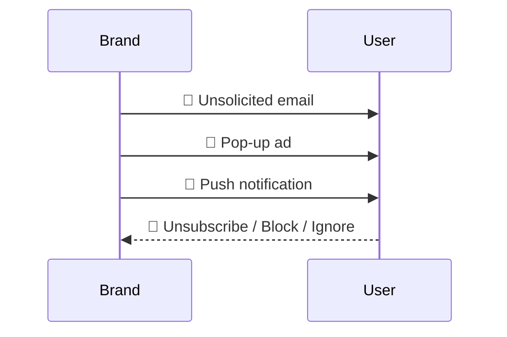
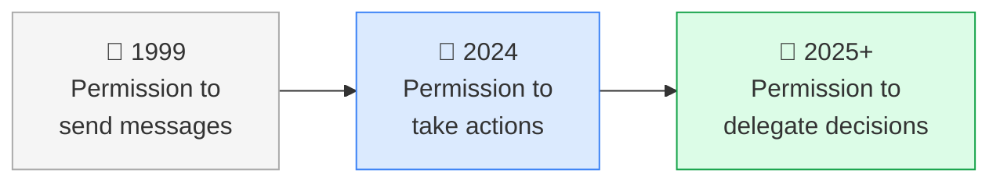
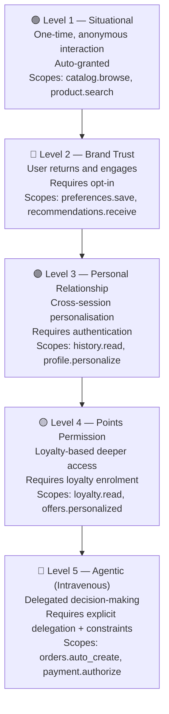
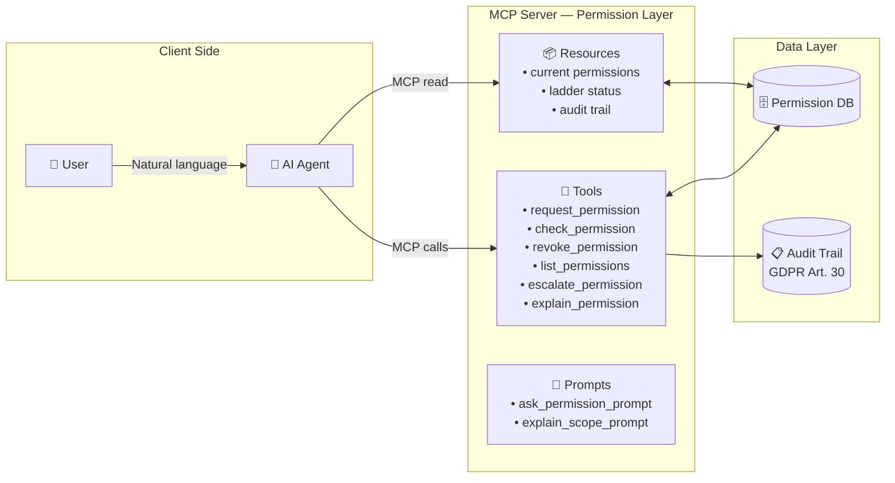
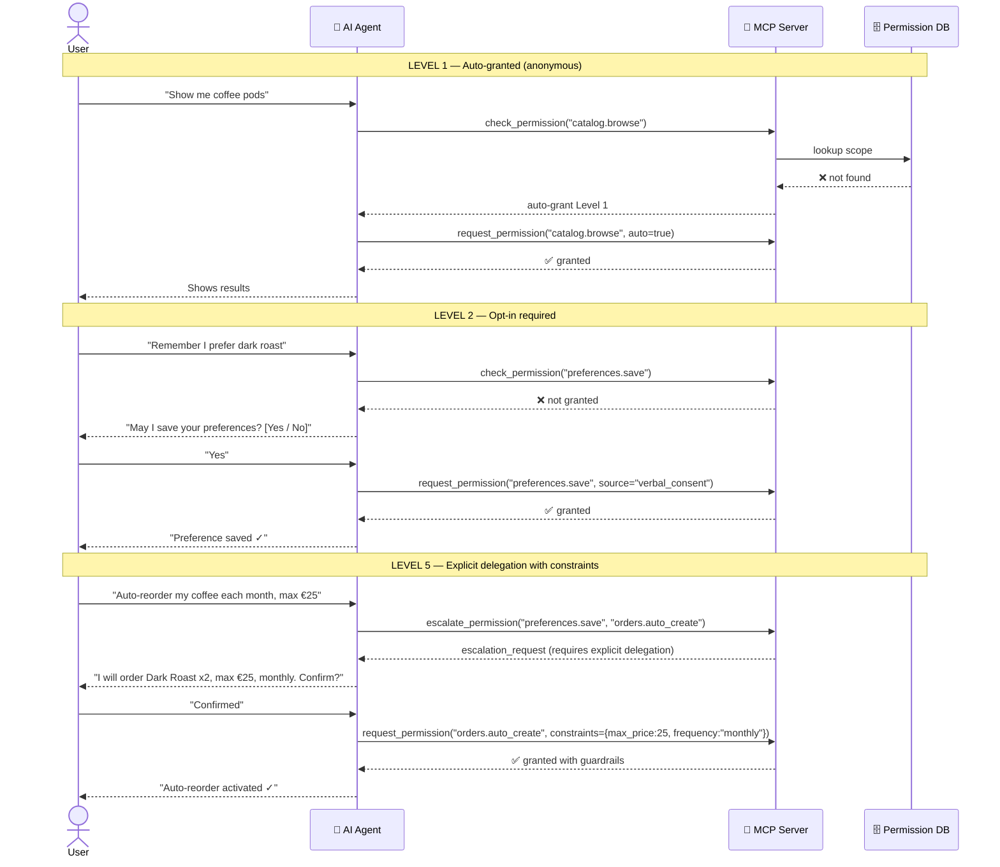
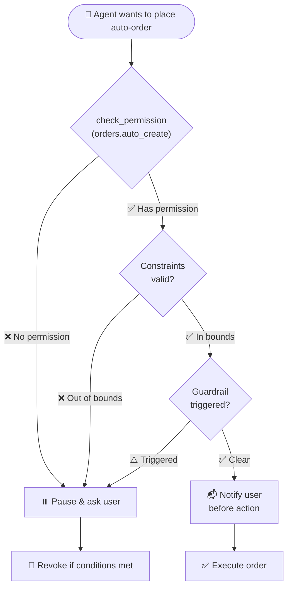
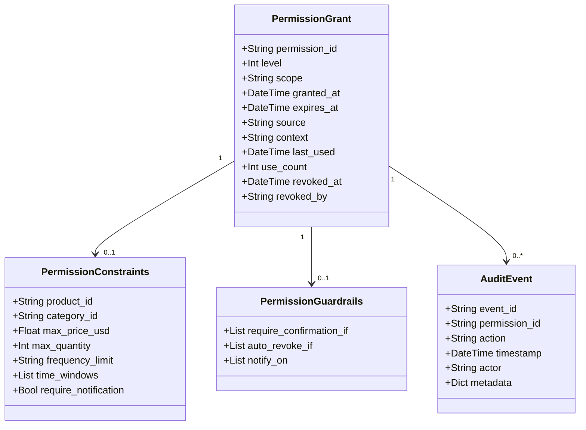

```mermaid
flowchart LR
    subgraph INT ["❌ Interruption Marketing"]
        direction TB
        I1["Push without asking"]
        I2["Same message to all"]
        I3["Volume over relevance"]
        I4["Result: distrust, blocking"]
    end

    subgraph PERM ["✅ Permission Marketing"]
        direction TB
        P1["Ask before sending"]
        P2["Personalised content"]
        P3["Value exchange"]
        P4["Result: engagement, loyalty"]
    end

    subgraph AGENT ["🚀 Agentic Delegation"]
        direction TB
        A1["Ask before acting"]
        A2["Constrained autonomy"]
        A3["Guardrails + audit"]
        A4["Result: trusted automation"]
    end

    INT -->|"Godin 1999"| PERM
    PERM -->|"MCP 2024"| AGENT
```

# Presentation Script & Schemas
## "From Interruption to Delegation — Permission Marketing in the Agentic AI Era"

> **Usage:** This file is your template-independent storyboard.  
> Every slide has its **title**, **body text**, **speaker notes**, and an **embedded diagram** where relevant.  
> When your PowerPoint template is ready, copy each slide section directly into it.

---

## SLIDE 1 — Title Slide

### Headline
**From Interruption to Delegation**  
Permission Marketing in the Agentic AI Era

### Sub-headline
*Operationalizing Seth Godin's framework with the Model Context Protocol (MCP)*

### Speaker Notes
> Welcome everyone. Today I want to talk about a shift in how we think about AI agents and the relationship they have with users — specifically about the concept of **permission**. We'll go from a 25-year-old marketing idea all the way to a working technical implementation.

---

## SLIDE 2 — The Problem: Interruption Marketing

### Headline
The Old Playbook: Interruption Marketing

### Body Text
- **Interrupt** → grab attention at any cost
- **Broadcast** → same message to everyone
- **Assume** → the user wants this
- Result: ignored, blocked, distrusted

### Schema — Interruption Flow

### Speaker Notes
> We are all familiar with this model. Marketing teams send millions of messages hoping a small percentage will react. AI agents that act without asking permission are doing the same thing — but at machine speed and scale. The result is broken trust.

---

## SLIDE 3 — Seth Godin's Answer (1999)

### Headline
Permission Marketing — The Privilege, Not the Right

### Quote
> *"Permission Marketing is the privilege (not the right) of delivering anticipated, personal, and relevant messages to people who actually want to receive them."*
> — **Seth Godin**, 1999

### Key Words
| Word | Meaning |
|------|---------|
| **Privilege** | It must be earned |
| **Anticipated** | The user expects it |
| **Personal** | It is relevant to them |
| **Relevant** | It brings them value |

### Speaker Notes
> Godin published this in 1999. It was about email marketing. Today, the same principle applies to AI agents. Replace "messages" with "actions" and the framework holds perfectly.

---

## SLIDE 4 — Extending the Concept to Agentic AI

### Headline
From Messages to Actions

### Body Text
In the Agentic AI era, permission is not just about **receiving messages**.  
It is about **delegating decisions**:

- Can the agent **remember my preferences**?
- Can it **act on my behalf**?
- Within what **constraints and guardrails**?

### Schema — Evolution

### Speaker Notes
> The shift is simple: what Godin called "messages" we now call "actions." An agent that browses, recommends, orders, or auto-reorders on your behalf needs the same layered permission structure Godin described — it just needs to be technically enforced.

---

## SLIDE 5 — The Permission Ladder

### Headline
5 Levels of Earned Permission

### Schema — The Ladder

### Table View (alternative for slide body)

| Level | Label | Key Idea | Auto-Grant |
|-------|-------|----------|------------|
| 1 | Situational | Anonymous browsing | ✅ Yes |
| 2 | Brand Trust | Save preferences | ❌ Opt-in |
| 3 | Personal Relationship | Cross-session memory | ❌ Login required |
| 4 | Points Permission | VIP offers | ❌ Loyalty enrolment |
| 5 | Agentic (Intravenous) | Autonomous action | ❌ Explicit delegation |

### Speaker Notes
> Each rung is **earned**, not assumed. The agent moves up the ladder by delivering value, demonstrating reliability, and explicitly requesting the next level of trust. Critically, the user can step back down at any time.

---

## SLIDES 5b & 6 — What is MCP?

> See [MCP_EXPLAINED.md](MCP_EXPLAINED.md) for the full content of these two slides:
> - **Slide 5b** — Protocol Stack Analogy (Physical → IP → TCP → HTTP → MCP)
> - **Slide 6** — MCP Technical Layer (Tools · Resources · Prompts)

---

## SLIDE 7 — The Architecture

### Headline
Permission Marketing MCP — Full Architecture

### Schema

### Speaker Notes
> Here is the full picture. The user speaks natural language to the agent. The agent translates every action into an MCP call. Our server either grants, checks, escalates, or blocks based on the current permission ladder level. Every decision is logged.

---

## SLIDE 8 — The 6 Core Tools

### Headline
MCP Tools — What the Agent Can Do

### Body Text

| Tool | Purpose | When Used |
|------|---------|-----------|
| `request_permission` | Ask user for a new scope | Before any new type of action |
| `check_permission` | Verify permission before acting | Every time, before every action |
| `revoke_permission` | Remove a permission | User or system initiated |
| `list_permissions` | Show all active permissions | Transparency, user review |
| `escalate_permission` | Move from Level N → N+1 | When deeper access is needed |
| `explain_permission` | Human-readable explanation | User education, consent UX |

### Speaker Notes
> These six tools enforce a single rule: **the agent never assumes**. Before every action it calls `check_permission`. Before any new capability it calls `request_permission`. The user is always in control.

---

## SLIDE 9 — The Permission Escalation Flow

### Headline
Complete User Journey — From Browsing to Delegation

### Schema

### Speaker Notes
> This is the key diagram. Notice that Level 1 is seamless — no friction. As we climb the ladder, the agent pauses and asks. Level 5 requires the user to see exactly what will happen before confirming. The constraints are technically enforced, not just UI promises.

---

## SLIDE 10 — Level 5 Guardrails (Deep Dive)

### Headline
Agentic Delegation — Constraints & Guardrails

### Body Text
Level 5 permission is **never open-ended**. Every delegation includes:

**Constraints** (what limits the scope):
- Specific product or category
- Maximum price per action
- Maximum quantity
- Frequency limit (daily / weekly / monthly)
- Allowed time windows

**Guardrails** (when to stop and ask):
- Price exceeds limit → pause
- Product out of stock → pause
- User hasn't engaged in 60 days → pause

### Schema

### Speaker Notes
> This is what makes Level 5 safe. The constraints live inside the permission record in the database — the agent cannot bypass them. The guardrails handle edge cases. If anything is unclear, the default is always to pause and ask, never to act unilaterally.

---

## SLIDE 11 — The Data Model

### Headline
Permission Record — What We Store

### Schema

### Speaker Notes
> Every permission record carries its own constraints and guardrails. The audit trail is append-only and linked to each permission — this is what allows GDPR Article 30 compliance out of the box. The `source` field records the user's exact words or action that triggered the grant.

---

## SLIDE 12 — GDPR & Compliance

### Headline
Compliance by Design — Not an Afterthought

### Body Text

| GDPR Requirement | How It Is Addressed |
|-----------------|---------------------|
| **Article 7** — Consent must be specific | Every permission has a named `scope` |
| **Article 7** — Consent freely given | `revoke_permission` available at any time |
| **Article 13/14** — Transparency | `explain_permission` tool provides clear explanation |
| **Article 30** — Records of processing | Append-only audit trail per permission |
| **Article 17** — Right to erasure | Revoke chain removes all downstream scopes |

### Speaker Notes
> By implementing permission as first-class data objects, GDPR compliance is structural. You cannot grant a vague permission. You cannot hide what an agent is doing. You cannot prevent a user from revoking access. These constraints are in the code, not a policy document.

---

## SLIDE 13 — Interruption vs. Permission vs. Delegation

### Headline
Three Paradigms — Side by Side

### Schema

### Speaker Notes
> This is the evolution story in one diagram. We are not inventing something new — we are taking a well-proven marketing principle and encoding it into software so that AI agents can operate with the same level of trust that the best human-to-customer relationships achieve.

---

## SLIDE 14 — Live Demo Summary

### Headline
Demo Scenario — Coffee Auto-Reorder

### Scenario Steps

1. **User:** "Show me coffee pods" → Level 1 auto-granted, no friction
2. **User:** "Remember I prefer dark roast" → Level 2 requested, user opts in
3. **User:** "Use my order history for better recs" → Level 3 requested, user logs in
4. **User:** "Auto-reorder each month, max €25" → Level 5 requested, user sees exact constraints before confirming
5. **User:** "Stop the auto-reorder" → Level 5 revoked instantly via natural language

### Key Point for Audience
> At each step the agent **asks** before acting.  
> At Level 5 the constraints **live in the database** — they cannot be overridden by the model.

### Speaker Notes
> The demo runs from `permission_marketing_mcp.py`. You can run it with `python permission_marketing_mcp.py` after activating the virtual environment. The five steps above map exactly to the output the demo produces.

---

## SLIDE 15 — Key Takeaways

### Headline
Three Things to Remember

### Body Text

**1. Permission is earned, not assumed**
> The agent climbs the ladder by delivering value, not by claiming rights.

**2. Level 5 is safe only with constraints**
> Autonomous action requires technically-enforced guardrails — not just UI promises.

**3. Trust is the product**
> The goal is not efficiency — it is a user who delegates because they trust the agent completely.

### Speaker Notes
> If the audience remembers only one thing, it should be this: permission is a technical contract, not a UI checkbox. MCP makes it possible to enforce that contract at every step.

---

## SLIDE 16 — Q&A / Discussion

### Headline
Questions & Discussion

### Anticipated Questions

**Q: Why MCP and not a custom API?**  
A: MCP is an open standard adopted by major AI platforms (Anthropic, OpenAI, Microsoft). Building on it means any compatible agent can use our permission layer without custom integration.

**Q: What prevents a model from ignoring the permission check?**  
A: The MCP architecture runs the permission server as a separate process. The model can only call declared tools — it has no direct access to the database or action layer.

**Q: How does this scale to millions of users?**  
A: The current implementation uses an in-memory store for demonstration. In production, replace it with a distributed store (Cosmos DB, Redis). The permission schema is designed for horizontal scaling — each record is self-contained.

**Q: Is this compatible with existing identity providers (OAuth, OIDC)?**  
A: Yes. The `source` and `context` fields are designed to carry OAuth tokens or OIDC claims. The `user_id` maps naturally to a subject claim.

---

## APPENDIX — Diagram Index

| Diagram | Slide | File | Type |
|---------|-------|------|------|
| Interruption Flow | 2 | PRESENTATION.md | Sequence |
| Evolution (Messages → Actions → Delegation) | 4 | PRESENTATION.md | Flowchart |
| The Permission Ladder | 5 | PRESENTATION.md | Flowchart |
| Protocol Stack (Physical → IP → TCP → HTTP → MCP) | 5b | [MCP_EXPLAINED.md](MCP_EXPLAINED.md) | Flowchart |
| MCP Role in the Stack | 6 | [MCP_EXPLAINED.md](MCP_EXPLAINED.md) | Flowchart |
| Full Architecture | 7 | PRESENTATION.md | Flowchart |
| User Journey (Escalation Flow) | 9 | PRESENTATION.md | Sequence |
| Level 5 Decision Tree | 10 | PRESENTATION.md | Flowchart |
| Data Model | 11 | PRESENTATION.md | Class Diagram |
| Three Paradigms Comparison | 13 | PRESENTATION.md | Flowchart |

---

## APPENDIX — Slide Count & Timing Guide

| Section | Slides | Suggested Time |
|---------|--------|----------------|
| Problem & Context | 2–4 | 5 min |
| Permission Ladder | 5 | 3 min |
| **MCP Intro — Protocol Stack Analogy** | **5b** | **3 min** |
| Technical Layer (MCP + Architecture) | 6–8 | 6 min |
| Escalation Flow & Guardrails | 9–10 | 5 min |
| Compliance & Comparison | 11–13 | 4 min |
| Demo & Takeaways | 14–15 | 4 min |
| Q&A | 16 | 7 min |
| **Total** | **17 slides** | **~37 min** |
